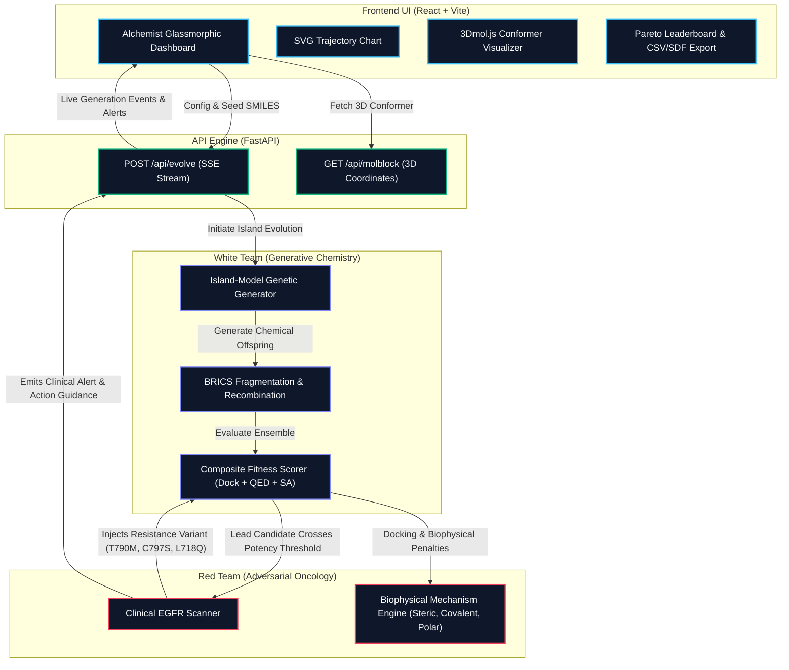

# Alchemist: Adversarial AI Drug Discovery Platform

**Alchemist** is a closed-loop Artificial Intelligence drug discovery platform engineered to programmatically co-evolve small-molecule therapeutics capable of anticipating and overcoming clinical tumor drug resistance (specifically focused on non-small cell lung cancer EGFR mutations).

By combining an **island-model genetic algorithm (White Team)** with an **automated oncology resistance scanner (Red Team)**, Alchemist acts as an adversarial self-playing engine: as lead compounds achieve high binding affinity, the system injects authentic clinical resistance mutations into the docking ensemble, forcing the generative engine to synthesize molecules that bind the entire mutational spectrum simultaneously.

---

## System Architecture



---

## Core Capabilities

### 1. Closed-Loop Adversarial Co-Evolution
Unlike static AI drug design platforms that target a single crystallized conformation, Alchemist models tumor biology as an active adversarial opponent:
- **White Team (Generative Chemistry)**: Evolves valid chemical structures by construction using RDKit and BRICS fragmentation, optimizing composite fitness across multi-target ensembles.
- **Red Team (Tumor Resistance Engine)**: Continuously evaluates lead candidate potency. When a compound achieves nanomolar affinity, the Red Team injects real clinical mutations to test the drug's resilience.

### 2. Real Clinical EGFR Resistance Hotspots
Alchemist features biophysical mechanism modeling for non-small cell lung cancer (NSCLC) mutations:

| Target Variant | Locus & Role | Biophysical Mechanism | Counter-Strategy (Generator Action) |
| :--- | :--- | :--- | :--- |
| **EGFR WT** | Catalytic Domain | Baseline ATP-binding pocket. | Dual H-bond hinge interaction. |
| **L858R** | Exon 21 Driver | Activating kinase mutation. | High-affinity binding to open kinase conformation. |
| **T790M** | Exon 20 Gatekeeper | Bulky methionine ($+54\text{ \AA}^3$) creates severe steric clash with 1st/2nd Gen quinazolines. | Shift to compact core ($\text{MW} < 410\text{ Da}$) or flexible hinge-breaker linkers. |
| **C797S** | Exon 20 Covalent Null | Abolishes nucleophilic thiol, destroying the covalent anchor of 3rd-Gen inhibitors (Osimertinib). | Transition from covalent reliance to high-affinity reversible binding. |
| **L718Q** | Exon 18/19 P-Loop | Hydrophobic-to-polar shift introduces electrostatic repulsion against lipophilic grease. | Reduce $\text{LogP} < 3.2$ and incorporate polar hydrogen-bond acceptors. |

### 3. Real-Time Interactive Web Dashboard
- **Generational Fitness Trajectory**: Live SVG chart streaming best and mean population fitness.
- **Active Target Panel**: Real-time status indicators tracking the expanding target ensemble (`WT`, `L858R`, `T790M`, `C797S`, `L718Q`).
- **Interactive 3D Conformer**: Embedded WebGL 3Dmol.js viewer with rotation, zoom, and atom picking.
- **Per-Variant Affinity Profile**: Live multi-target kcal/mol binding energy meters.
- **Export Capabilities**: One-click download of Pareto-optimal candidates in both **CSV** and **.SDF** formats.

---

## Quickstart Guide

### Prerequisites
- **Python**: 3.10+
- **Node.js**: 18+ and npm

### 1. Backend Setup

```bash
# Clone the repository
git clone https://github.com/Mridul-06-stack/MOL-DESIGNER.git
cd MOL-DESIGNER

# Create and activate virtual environment
python3 -m venv .venv
source .venv/bin/activate

# Install dependencies
pip install -e .
pip install rdkit fastapi uvicorn websockets pytest

# Run automated tests
pytest tests/ -v
```

### 2. Start the FastAPI Engine

```bash
source .venv/bin/activate
uvicorn server.api:app --host 127.0.0.1 --port 8000 --reload
```
The API server will be available at `http://127.0.0.1:8000`.

### 3. Launch the React Dashboard

In a separate terminal:
```bash
cd ui
npm install
npm run dev
```
Open `http://127.0.0.1:5173` in your browser.

---

## Automated Test Suite

Alchemist includes a comprehensive pytest test suite covering docking, genetic algorithms, and clinical scanner mechanisms:

```bash
pytest tests/test_scanner.py tests/test_docking.py -v
```

```
============================== 13 passed in 0.34s ==============================
```

---

## Cloud Deployment

Alchemist is architected for **zero-CORS, unified cloud deployment** as well as decoupled microservices.

### Option 1: 1-Click Render Deployment (Recommended)

1. Fork or push this repository to GitHub.
2. Sign in to [Render](https://render.com/).
3. Click **New +** $\rightarrow$ **Blueprint** and connect your repository.
4. Render detects `render.yaml` and deploys both the FastAPI engine and React dashboard under a single HTTPS URL (`https://alchemist.onrender.com`).

### Option 2: Hugging Face Spaces (Bioinformatics & AI Hackathons)

1. Create a new Space on [Hugging Face](https://huggingface.co/spaces).
2. Choose **Docker** as the Space SDK.
3. Push this repository or connect your GitHub repo.
4. Hugging Face builds the multi-stage `Dockerfile` and hosts the live application directly on your Space.

### Option 3: Local or Self-Hosted Docker Container

```bash
# Build the unified container
docker build -t alchemist:latest .

# Run on port 8000
docker run -p 8000:8000 alchemist:latest
```
Access the complete dashboard at `http://localhost:8000`.

---

## License
MIT License. Developed for research and educational purposes in computational oncology and generative chemistry.
