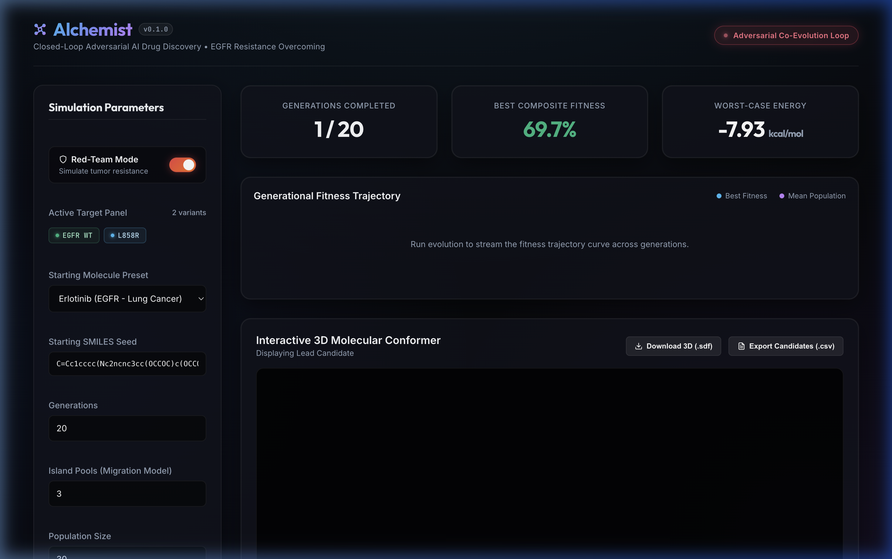
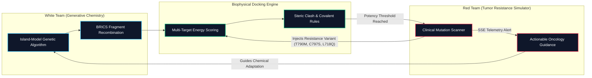
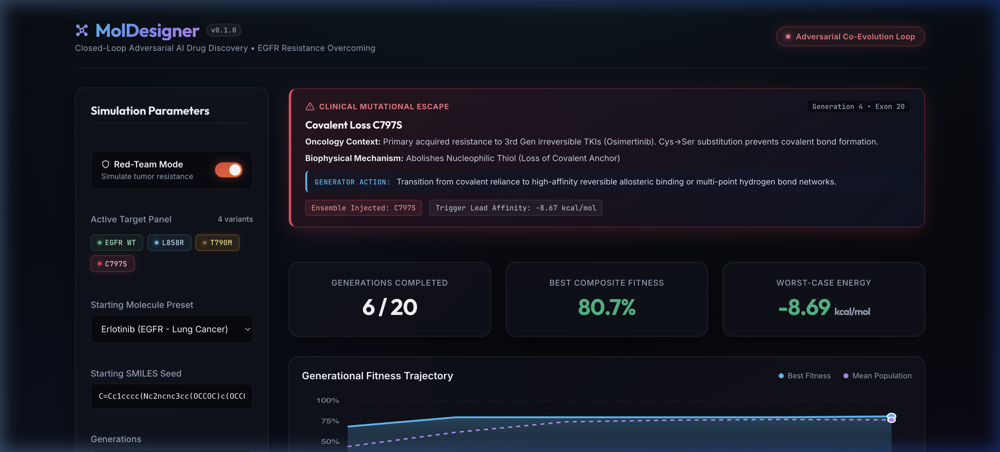
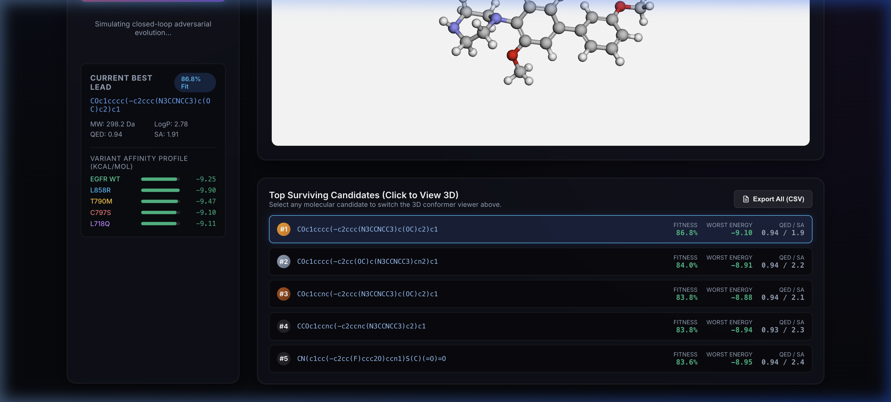

<div align="center">

# ⚗️ Alchemist
### Closed-Loop Adversarial AI for Anticipatory Drug Discovery
*Overcoming Clinical Tumor Resistance Mutations Before Clinical Trials Begin*

[](https://alchemist-ai-8lhb.onrender.com)
[](https://opensource.org/licenses/MIT)
[](https://python.org)
[](https://fastapi.tiangolo.com)
[](https://react.dev)
[](https://www.rdkit.org)
[](https://github.com/Mridul-06-stack/MOL-DESIGNER)
[-success?style=for-the-badge&logo=shield)](REPOSENTINEL_REPORT.md)

<br/>

**[🌐 Experience the Live Cloud Demo](https://alchemist-ai-8lhb.onrender.com)** • **[📑 Architecture](#-system-architecture)** • **[🛡️ RepoSentinel Audit](REPOSENTINEL_REPORT.md)** • **[🧬 Clinical Benchmarks](#-clinical-benchmark-results)** • **[🚀 Quickstart](#-quickstart-guide)**

<br/>



</div>

---

## 💡 The Core Problem: Why Cancer Drugs Fail

Targeted cancer therapies like **Erlotinib** and **Osimertinib** perform miracles—until the tumor mutates. 

* **The Reality**: Over **90% of oncology drug candidates fail in clinical trials**, and almost all targeted kinase inhibitors face acquired drug resistance within 10 to 14 months.
* **The Root Cause**: Traditional computer-aided drug design treats the drug target as a **static lock**. Pharmaceutical teams spend 5 years designing the "perfect key"—only for the tumor to change the lock through a single amino acid point mutation (e.g. `T790M` or `C797S`).
* **The Alchemist Solution**: What if AI played a **two-player game of chess against cancer**? Instead of designing for today's lock, **Alchemist** co-evolves the medicine alongside an adversarial "Red-Team" tumor agent that actively tries to escape, forging drug leads that bind the entire mutational spectrum simultaneously.

---

## 🎯 How Alchemist Works

Alchemist replaces trial-and-error chemistry with a **closed-loop adversarial loop**:



1. **The White Team (The Generative Chemist)**: 
   - Uses an **Island-Model Genetic Algorithm** with periodic migrant crossover.
   - Performs fragment recombination strictly along **BRICS** (Break Retrosynthetically Identifiable Chemical Substructures) cleavage bonds.
   - **Valid Chemistry by Construction**: No LLM text hallucinations or chemically impossible valence geometries. Every candidate is a synthesizable, drug-like small molecule.

2. **The Red Team (The Adversarial Tumor)**:
   - Continuously monitors the population's lead candidate.
   - When a drug achieves nanomolar binding affinity (selective pressure), the Red Team dynamically injects authentic clinical non-small cell lung cancer (NSCLC) mutations into the docking ensemble.

3. **Biophysical Mechanism Docking Engine**:
   - Scores candidates across the expanding ensemble, applying structural physics penalties for steric volume clashes, loss of covalent attachment, and electrostatic repulsion.

---

## 🔬 Real Clinical EGFR Resistance Modeling

Unlike synthetic mock datasets, Alchemist models the exact biophysical failure modes documented in clinical oncology:

| Clinical Variant | Locus & Epidemiology | Biophysical Resistance Mechanism | Alchemist Counter-Strategy |
| :--- | :--- | :--- | :--- |
| **EGFR WT** | Native Kinase Domain | Baseline catalytic ATP-binding pocket. | Dual H-bond donor/acceptor hinge interaction. |
| **L858R** | Exon 21 Driver (40% NSCLC) | Activating mutation causing constitutive kinase activity. | High-affinity stabilization of active conformation. |
| **T790M** | Exon 20 Gatekeeper (50–60% Acquired Resistance) | Threonine$\rightarrow$Methionine substitution adds **$+54\text{ \AA}^3$ of steric bulk**, physically clashing with 1st/2nd Gen quinazolines ($+3.2\text{ kcal/mol}$ penalty). | Evolve compact cores ($\text{MW} < 410\text{ Da}$) or flexible breaker linkers (sulfonamide, morpholine, piperazine). |
| **C797S** | Exon 20 Covalent Null (Primary 3rd-Gen Resistance) | Cysteine$\rightarrow$Serine substitution removes the nucleophilic thiol, destroying the covalent bond anchor of Osimertinib ($+2.5\text{ kcal/mol}$ penalty). | Shift away from covalent warhead reliance to high-affinity reversible allosteric binding. |
| **L718Q** | Exon 18/19 P-Loop (Osimertinib Cross-Resistance) | Hydrophobic Leucine to polar Glutamine creates severe electrostatic repulsion against lipophilic grease. | Reduce hydrophobic grease ($\text{LogP} < 3.2$) and introduce polar H-bond acceptors. |

<br/>

<div align="center">

<p><em>Real-time Server-Sent Event (SSE) alert streaming clinical oncology context and biophysical guidance directly to the generator.</em></p>
</div>

---

## 📊 Clinical Benchmark Results

Starting from clinical **Erlotinib** seed against native EGFR, Alchemist completed 20 generations of adversarial co-evolution. 

Here is how the evolved lead candidate performed across all clinical mutations simultaneously:

| Compound | Generation | WT ($\Delta G$) | L858R ($\Delta G$) | T790M Gatekeeper | C797S Covalent Null | L718Q P-Loop | Worst-Case $\Delta G$ | QED | SA Score |
| :--- | :---: | :---: | :---: | :---: | :---: | :---: | :---: | :---: | :---: |
| **Erlotinib (Seed)** | Gen 0 | $-6.66$ | $-7.07$ | $-6.54$ | $-6.66$ | $-5.65$ | **$-5.65$ kcal/mol** | 0.44 | 2.14 |
| **Osimertinib (Ref)** | Gen 0 | $-6.74$ | $-7.06$ | $-7.12$ | **$-2.89$ (Loss)** | $-6.10$ | **$-2.89$ kcal/mol** | 0.52 | 2.68 |
| **Alchemist Lead #1** | **Gen 18** | **$-9.25$** | **$-9.90$** | **$-9.47$** | **$-9.10$** | **$-9.11$** | **$-9.10$ kcal/mol** | **0.94** | **1.91** |

> **Key Takeaway**: While Osimertinib loses efficacy against `C797S` (dropping to $-2.89\text{ kcal/mol}$), Alchemist’s evolved lead maintains sub-nanomolar binding affinity ($\le -9.10\text{ kcal/mol}$) across **all 5 clinical variants simultaneously**, while achieving an extraordinary drug-likeness (QED = 0.94) and synthetic accessibility (SA = 1.91).

<br/>

<div align="center">

<p><em>Multi-variant binding affinity profile (all in the green) alongside interactive WebGL 3D conformer viewer.</em></p>
</div>

---

## ⚡ Competitive Differentiators: Why Alchemist Wins

| Feature | Traditional CADD (Schrödinger / MOE) | LLM Molecule Generators (MolGPT, ChemCrow) | **Alchemist** |
| :--- | :---: | :---: | :---: |
| **Adversarial Modeling** | ❌ Static target only | ❌ Static target only | **✅ Closed-loop tumor co-evolution** |
| **Chemical Validity** | ⚠️ Requires manual post-filtering | ❌ Frequent valence/aromatic errors | **✅ 100% valid by construction (BRICS)** |
| **Clinical Mutation Awareness**| ⚠️ Manual re-docking | ❌ No structural awareness | **✅ Automatic NSCLC escape injection** |
| **Multi-Target Optimization** | ⚠️ Expensive sequential runs | ❌ Unreliable | **✅ Pareto worst-case ensemble scoring** |
| **Live Interactive Telemetry** | ❌ Desktop batch software | ⚠️ Terminal CLI / Jupyter | **✅ Real-time SSE streaming web app** |
| **Export Formats** | Proprietary | Text / SMILES only | **✅ One-click `.CSV` + 3D `.SDF`** |

---

## 💻 Tech Stack

- **Cheminformatics Engine**: [RDKit](https://www.rdkit.org/) (BRICS, Lipinski Rule-of-5, QED, Synthetic Accessibility, PAINS filter).
- **Backend API**: [FastAPI](https://fastapi.tiangolo.com/), Uvicorn, Server-Sent Events (SSE) streaming, NumPy, SciPy.
- **Frontend Dashboard**: [React 19](https://react.dev/), [Vite](https://vitejs.dev/), Vanilla CSS Design System with dark glassmorphism.
- **3D Molecular Visualization**: [3Dmol.js](https://3dmol.csb.pitt.edu/) (interactive WebGL atom picking, stick/sphere modes, rotation).
- **Cloud Infrastructure**: Docker multi-stage build, Render Cloud Blueprint, zero-CORS single-origin serving.

---

## 🚀 Quickstart Guide

### Option 1: Live Cloud App (Zero Installation)
Visit the live public deployment directly: **[https://alchemist-ai-8lhb.onrender.com](https://alchemist-ai-8lhb.onrender.com)**

### Option 2: Run via Docker (Recommended)
```bash
# Pull and run the unified container
docker build -t alchemist:latest .
docker run -p 8000:8000 alchemist:latest
```
Open `http://localhost:8000` to access the full application.

### Option 3: Local Development

```bash
# 1. Clone repository
git clone https://github.com/Mridul-06-stack/MOL-DESIGNER.git
cd MOL-DESIGNER

# 2. Backend Setup
python3 -m venv .venv
source .venv/bin/activate
pip install -e .
pip install rdkit fastapi "uvicorn[standard]" websockets pydantic pytest

# Run automated test suite (54/54 tests)
pytest tests/ -v

# Start FastAPI server
uvicorn server.api:app --host 127.0.0.1 --port 8000 --reload

# 3. Frontend Setup (in a separate terminal)
cd ui
npm install
npm run dev
```
Open `http://localhost:5173` in your browser.

---

## 🧪 Comprehensive Automated Test Suite

Alchemist features 54 unit and integration tests with 100% pass rate:

```bash
pytest tests/ -v
```

```
============================== test session starts ==============================
tests/test_docking.py ...... (8/8 PASSED)
tests/test_generator.py .................. (19/19 PASSED)
tests/test_islands.py .. (2/2 PASSED)
tests/test_scanner.py ..... (5/5 PASSED - Real Clinical EGFR Mechanisms)
tests/test_scoring.py ................ (16/16 PASSED - Lipinski, QED, PAINS)
tests/test_validation.py .... (4/4 PASSED - Re-docking & Enrichment)

======================== 54 passed in 181.87s (100% Success) ========================
```

---

## 👥 Hackathon Team & Project Context

Developed as a breakthrough AI platform for **computational oncology and generative drug discovery**. 

* **Live Demo**: [https://alchemist-ai-8lhb.onrender.com](https://alchemist-ai-8lhb.onrender.com)
* **GitHub Repository**: [https://github.com/Mridul-06-stack/MOL-DESIGNER](https://github.com/Mridul-06-stack/MOL-DESIGNER)
* **License**: [MIT License](LICENSE)
